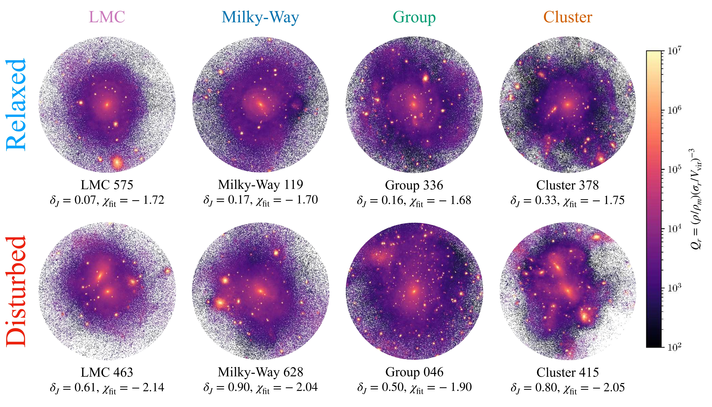

# Symphony-PPSD

Pseudo Phase Space Density (PPSD) analysis toolkit for cold dark matter (CDM) host halos in the **[Symphony Simulation Suite](https://arxiv.org/abs/2109.04476)**.

## Overview

This repository provides comprehensive tools for investigating Pseudo Phase Space Density (PPSD) profiles of host halos from the Symphony simulations. Our project focuses on investigating connections between PPSD profiles and host halo mass assembly history.

## Quick Start

Run the complete analysis pipeline:

```bash
python main.py
```

This executes:
1. Measure and save the density profiles, velocity dispersion profiles, velocity anisotropy profiles, PPSD profiles and we also provide the scripts to visualize them.
2. Compute and save host halo properties: concentration, dynamical accretion rate, deviation from jeans equation, virial ratio and best fit PPSD slope.
3. Visualize density, temperature and PPSD projected maps.

We also support studying redshift evolution of above-mentioned profiles once one gets the full snapshots of Symphony.

## Main finding
PPSD does not follow a universal self-similar power law, but is instead shaped by halo mass assembly history. Host halos with larger deviations from Jeans equilibrium systematically develop steeper PPSD slopes.



See more figures in ```./figure``` directory.